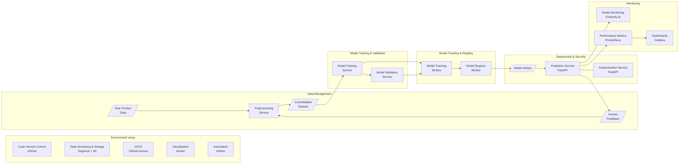

# Rakuten Product Category Classification – MLOps Reference Implementation

A production‑grade, **end‑to‑end MLOps pipeline** for automatic product‑type classification on the Rakuten retail dataset.
While the underlying model currently relies on text features (SGD + TF‑IDF), the focus of this repository is the surrounding **operational ecosystem**: repeatable data pipelines, experiment tracking, automated testing/deployment, secure inference services and production monitoring.

---

## Table of Contents

1. [High‑Level Architecture](#high‑level-architecture)
2. [Repository Layout](#repository-layout)
3. [Quick Start](#quick-start)
4. [Pipeline Walk‑Through](#pipeline-walk‑through)
5. [Versioning & Experiment Tracking](#versioning--experiment-tracking)
6. [Orchestration & Automation](#orchestration--automation)
7. [Monitoring & Observability](#monitoring--observability)
8. [Security & Access Control](#security--access-control)
9. [Testing & CI/CD](#testing--cicd)
10. [Project Roadmap](#project-roadmap)
11. [Contributing](#contributing)
12. [License](#license)

---

## High‑Level Architecture



*The diagram shows the complete lifecycle from raw data ingestion through to monitored deployment in production.*

---

## Repository Layout

```text
mlops-rakuten-project/
├── docker-compose.yml              # Multi service training Pipeline
├── dockerfiles/                    # One Dockerfile per micro‑service
├── dags/                           # Airflow DAGs
├── monitoring/                     # Monitoring Metafiles
├── plugins/                        # Domain logic
│   └── cd4ml/                      #  ├─ data_processing/
│                                   #  ├─ model_training/
│                                   #  ├─ model_validation/
|                                   #  ├─ tests/
│                                   #  └─ inference/
├── shared_volume/                  # **DVC‑tracked** data & models
├── ui_app.py                       # Streamlit front‑end
└── README.md                       # (this file)
```

> **Note:** All persistent artefacts (data, models, vectoriser, feedback CSV …) live under `shared_volume/` and are version‑controlled with **DVC**.

---

## Quick Start

### 1 – Prerequisites

* **Docker ≥ 23** – Runtime engine for all containerised services.
* **`docker compose` CLI** – Starts the entire stack in one shot.
* **Git** – Required to clone / fork *this* repository; present inside the containers for internal commits.
* **DVC** – Already included into the Docker images for pipeline steps. Install *locally* only if you need to run `dvc pull/push` outside the containers (see [`READ_ME_FOR_DVC.md`](READ_ME_FOR_DVC.md)).

### 2 – Clone & configure

```bash
git clone https://github.com/BeritM/mlops-rakuten-project.git
cd mlops-rakuten-project
cp .env.example .env        # fill in GitHub & Dagshub creds
```

### 3 – Run the full stack locally

```bash
# Pull raw data / models from Dagshub & execute the pipeline
docker compose up --build
# ⇒  http://localhost:8001  Auth Service
# ⇒  http://localhost:8002  Prediction API
# ⇒  http://localhost:3000  Grafana
# ⇒  http://localhost:9090  Prometheus
# ⇒  http://localhost:8080  Airflow
```

*Artifacts and metrics will be pushed automatically to GitHub/Dagshub.*

### 4 – Launch the Streamlit demo

```bash
streamlit run ui_app.py
```
---

## Pipeline Walk‑Through

### Data Management

* **Ingestion & Pre‑processing** `plugins/cd4ml/data_processing/run_preprocessing.py`
  Cleans multilingual text, splits sets, computes TF‑IDF, stores artefacts to DVC.
* **Versioning** Full lineage of raw/processed data, models and feedback stored on a Dagshub‑backed **S3 bucket**.

### Model Training

* **Algorithm** `SGDClassifier` (logistic loss) with custom class weights.
* **Experiment Tracking** All params, metrics & artefacts logged to **MLflow**; model registered under alias `production`.

### Validation & Auto‑Promotion

* Validation container compares new F1‑score against the currently deployed model and, if improved, *promotes* the run via MLflow aliasing.

### Deployment

* **Auth Service** – FastAPI, JWT (HS256), role‑based CRUD over `/users`.
* **Predict Service** – FastAPI, loads vectoriser + model from MLflow; requires `token` header issued by Auth service.
* **UI** – Streamlit dashboard for manual predictions & feedback collection.

---

## Versioning & Experiment Tracking

| Layer             | Tooling      | Remote                                     |
| ----------------- | ------------ | ------------------------------------------ |
| **Code**          | Git + GitHub | `main` ➜ protected                        |
| **Data / Models** | DVC          | S3 bucket (Dagshub)                        |
| **Experiments**   | MLflow       | Dagshub‑hosted MLflow server               |

The helper script `dvc_push_manager.py` automates *DVC ➜ Git* synchronisation.

---

## Orchestration & Automation

* **Local** – `docker‑compose.yaml` wires the individual services and shared volumes.
* **Batch** – `ml_pipeline_mixed_experiment_dvc.py` Airflow DAG runs every 10 min and orchestrates the four Docker containers with `DockerOperator`.
* **CI / Tests** – GitHub Actions build images, execute linters + the PyTest suite located in `plugins/cd4ml/tests`.

---

## Monitoring & Observability

Spin up the full observability stack:

```bash
docker compose -f docker-compose.monitoring.yml up -d
```

| Aspect                 | Implementation                                                                                                                                                                                                                                                                    |
| ---------------------- | --------------------------------------------------------------------------------------------------------------------------------------------------------------------------------------------------------------------------------------------------------------------------------- |
| **Service health**     | FastAPI `/health` endpoints for **auth\_service** & **predict\_service** + Docker health‑checks.                                                                                                                                                                                  |
| **Metrics**            | **Prometheus** scrapes container metrics *and* ingests batch KPIs (e.g. weighted F1) via **Pushgateway** – populated by `monitor/monitor.py`.                                                                                                                                     |
| **Dashboards**         | **Grafana** (port 3000) with pre‑wired Prometheus data‑source; import or build panels on the fly.                                                                                                                                                                                 |
| **Alerting**           | **Alertmanager** (port 9093) already referenced in `prometheus.yml`; add rules in `monitoring/prometheus/alert_rules.yml`.                                                                                                                                                        |
| **Data / Model Drift** | Dedicated **drift monitor** (<code>drift\_monitor\_service:8003</code>) uses Evidently to compute drift metrics, pushes them to Pushgateway and stores HTML/JSON reports in <code>logs/</code>. See [`README-drift.md`](README-drift.md) for details & manual execution commands. |                                         |

---

## Security & Access Control

* Separate **auth** and **predict** micro‑services – principle of least privilege.
* JWT tokens (`/login`) include `sub` and `role`; default expiry 30 min.
* Admin endpoints protected by middleware (`Depends(admin_required)`).
* All inter‑service traffic remains inside the Docker network; only ports 8001/8002 exposed.

---

## CI/CD & Testing

A **single GitHub Actions workflow** (`.github/workflows/docker-publish.yml`) runs on each push to and pull from **`main`** or **`develop`**.

| Stage                   | What happens?                                                                                                          |
| ----------------------- | ---------------------------------------------------------------------------------------------------------------------- |
| **CodeQL Scan**         | Static code‑ & security‑analysis for Python.                                                                           |
| **Pytest**              | Runs unit tests for preprocessing & training *and* integration tests for API routes (via the dedicated `tests` image). |
| **Docker Build + Push** | Matrix builds *all* service images (dvc‑sync, preprocessing, training …) with Buildx and pushes them to Docker Hub.    |
| **Compose Build Check** | Verifies that the full `docker‑compose.yml` still builds end‑to‑end (no containers started).                           |

**Workflow Highlights**

* Layer‑caching and pip‑caching speed up builds.
* The `tests` container spins up **auth\_service + predict\_service**, waits for health checks and runs full request‑flow tests.
* Concurrency guard cancels redundant runs on the same branch.
* Docker Hub creds are injected via GitHub Secrets.

A green check‑mark in GitHub shows the pipeline passed.

---

### Local Endpoints

| Service        | URL                     | Notes                                                 |                                                                                                    |
| -------------- | ----------------------- | ----------------------------------------------------- | -------------------------------------------------------------------------------------------------- |
| Airflow Web UI | `http://localhost:8080` | DAG management                                        |                                                                                                    |
| Auth API       | `http://localhost:8001` | `/login`, `/users`, `/health`                         |                                                                                                    |
| Predict API    | `http://localhost:8002` | `/predict`, `/model-info`, `/feedback`, `/health`     |                                                                                                    |
| Grafana\*      | `http://localhost:3000` | Dashboards                                            |                                                                                                    |
| Prometheus\*   | `http://localhost:9090` | Metrics explorer                                      |                                                                                                    |
| Pushgateway\*  | `http://localhost:9091` | Receives batch metrics (e.g. F1) from monitoring jobs |                                                                                                    |
| Alertmanager\* | `http://localhost:9093` | Sends notifications based on Prometheus alert rules   


**Streamlit UI** (launch locally):

```bash
streamlit run ui_app.py --server.port 8501
```

→ [http://localhost:8501](http://localhost:8501)


---

## Outlook / Next Steps

* **Data persistence** – move raw & feedback tables to PostgreSQL, store large artefacts (models, vectoriser, metrics) in object storage (S3/GCS) for cheaper, scalable retention.
* **Auto‑scaling deployment** – containerise inference stack on Kubernetes (e.g. K3s or EKS) with Horizontal Pod Autoscaler.
* **Feature Store** – introduce Feast to guarantee online/offline feature parity.
* **Continuous drift detection** – hook Evidently alerts into Prometheus → Grafana; trigger auto‑retraining DAG on drift.
* **Security hardening** – container image scanning (Trivy) & Dependabot for vuln alerts.

---

## License

Licensed by the Rakuten Institute of Technology.

---

### Contributors

* BeritM
* Anomalisaa
* SebastianPoppitz
* Tubetraveller


